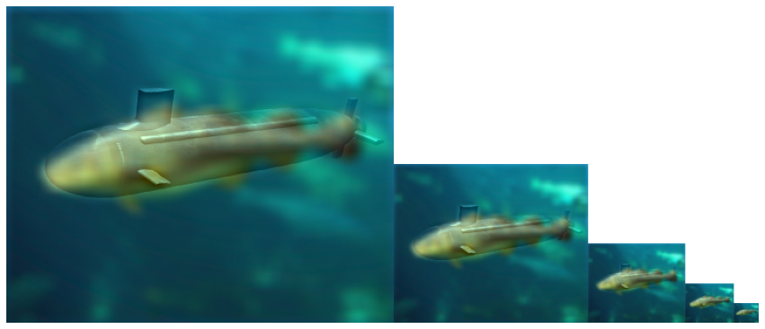
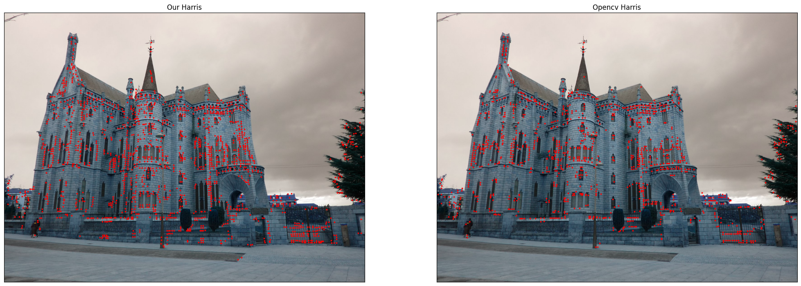
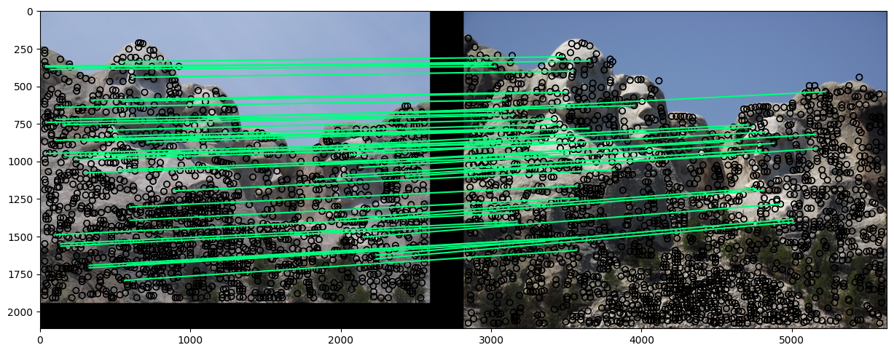
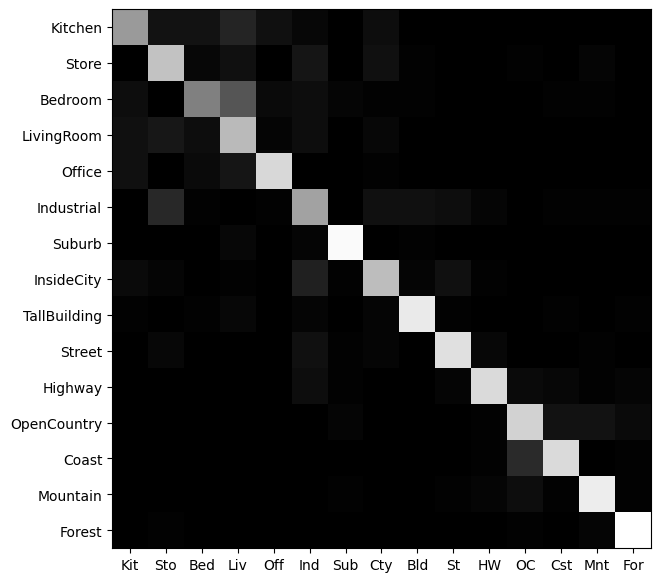

# Computer Vision Mini Projects

This repository contains three mini projects related to classic computer vision techniques. The projects are implemented in Python using various libraries such as NumPy, OpenCV, and scikit-learn. The projects are briefly described below:

## 1. Convolution in Time, Frequency Domains and hybrid images

This project implements the convolution operation in both the time and frequency domains from scratch using NumPy. The project compares the performance of the two methods and analyzes the advantages and disadvantages of each approach. The project includes functions to generate synthetic signals and filters for testing. The following hybrid Images can be created.

## 2. Object Matching using Simplified SIFT and Harris Corner Detection

This project implements a simplified version of the Scale-Invariant Feature Transform (SIFT) algorithm and the Harris corner detection algorithm to perform object matching in images. The project uses OpenCV to extract features and match them between two images. The project also includes functions to visualize the feature matching results.

## 3. Scene Recognition using Bag of Visual Words (BoW) and Machine Learning

This project uses the Bag of Visual Words (BoW) approach coupled with Support Vector Machines (SVM) and k-Nearest Neighbor (k-NN) classifiers to perform scene recognition on a dataset of images. The project uses OpenCV to extract features and scikit-learn to train and evaluate the classifiers. The project includes functions to visualize the classification results.

## Google Colab Links
[Mini-Project 1](https://colab.research.google.com/drive/1icSGa4fHPVMRNZ8grAEVx-SpAF439BRT?usp=sharing)

[Mini-Project 2](https://colab.research.google.com/drive/1W89wwPhsq3MXeEXyh883xGnjN8beTvKS?usp=sharing)

[Mini-Project 3](https://colab.research.google.com/drive/1onSVcE9HP_GN-J4lMEbX7A9i18C4sy6A?usp=sharing)

## Requirements
The projects require Python 3.5 or later and the following libraries:

- NumPy
- OpenCV
